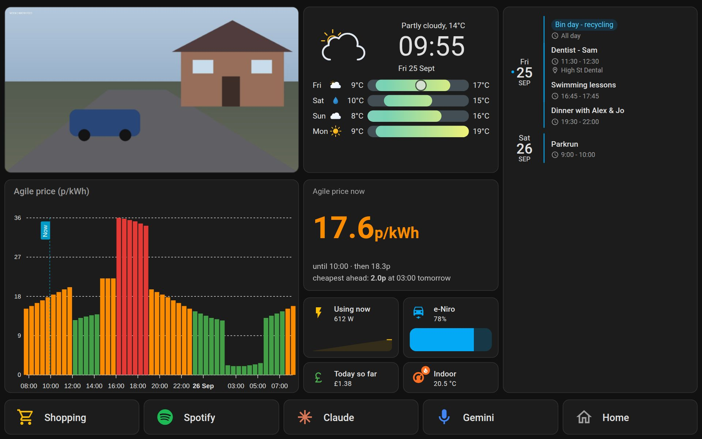

# Lenovo Tab M10 wall panel

A wall-mounted home panel for a Lenovo Tab M10. It shows the Nest camera, live electricity
use from the Octopus Home Mini, Agile prices for the rest of the day, indoor temperature,
today's calendar, the weather and the Kia's battery. It also has one-tap buttons for the
shopping list, Spotify, Claude, Gemini and the Android home screen. Voice is handled by
Gemini ("Hey Google…"), which is already on the tablet.



*Rendered by a real Home Assistant 2026.9 from the dashboard file in this repo, using
sample data. The camera picture is a placeholder.*

## Why it's built this way

**Home Assistant does the data. The tablet shows the dashboard. Gemini does the voice.**

- **Home Assistant** (free, open source, running on a small box on your network) already
  has maintained, free integrations for every data source you listed: Nest camera and
  thermostat, Octopus Home Mini and Agile, Google Calendar, weather, and Kia. Building
  those from scratch would mean writing and maintaining five API clients, including Google's
  camera streaming. Here, the whole panel is **one dashboard file**.
- **Voice** is left to the assistants you already have. Gemini on the tablet (and on any Nest
  speakers) already adds to a Google Keep shopping list, plays Spotify and opens apps.
  Claude's app has its own voice mode. The panel just gives each of these a big button.
- The tablet runs **Fully Kiosk Browser**. It keeps the dashboard on screen, wakes when
  someone walks up, dims at night, and lets the buttons open other apps.

| You asked for | How the panel does it |
|---|---|
| Google Home camera | Live view through Home Assistant's Nest integration (one-time US$5 Google fee) |
| Octopus live usage (Home Mini) | "Using now" in watts plus a 6-hour sparkline, and today's cost so far |
| Agile price now + rest of day | Big colour-coded price, next slot and cheapest slot ahead, plus a 24-hour bar chart that includes tomorrow once Octopus publishes it (~4pm). Agile is priced in **30-minute** slots |
| House temperature | "Indoor" tile from the Nest thermostat ("best thermostat" is assumed to mean Nest) |
| Today's Google Calendar | Today and tomorrow, finished events hidden |
| Weather | Clock, current conditions and a 4-day forecast (Met.no, no sign-up) |
| Kia e-Niro battery (optional) | Battery tile with a gauge (free integration; see [caveats](docs/integrations/kia.md)) |
| Shopping list + voice | **Shopping** button opens Google Keep. "Hey Google, add milk to my shopping list" |
| Spotify + voice | **Spotify** button. "Hey Google, play … on Spotify" |
| Claude voice mode | **Claude** button opens Claude's voice screen. "Hey Google, open Claude" |
| Gemini, button + voice | **Gemini** button. "Hey Google…" works anywhere |
| Back to the home screen | **Home** button |

## What it costs

| Item | Cost |
|---|---|
| Home Assistant box: [Home Assistant Green](https://www.home-assistant.io/green) (or a Raspberry Pi / old PC you already have) | ~£160–190 (or £0) |
| Google Device Access (needed for the Nest camera and thermostat) | US$5 once |
| Fully Kiosk Browser PLUS licence (recommended) | €7.90 once |
| Everything else: Home Assistant, HACS, all integrations and cards, Met.no, Octopus API, Kia Connect | free |

## Set-up order (about an afternoon)

1. **[Home Assistant](docs/home-assistant.md)**: install it and HACS, and add a user for the tablet. *(30–60 min)*
2. **Integrations**, in any order:
   - [Nest camera + thermostat](docs/integrations/nest.md) *(30 min, the fiddliest step)*
   - [Octopus Energy](docs/integrations/octopus.md) *(10 min)*
   - [Google Calendar](docs/integrations/google-calendar.md) *(15 min; reuses the Nest Google project)*
   - [Weather](docs/integrations/weather.md) *(nothing to do)*
   - [Kia (optional)](docs/integrations/kia.md) *(10 min)*
3. **[Dashboard](docs/dashboard.md)**: install six cards from HACS, fill in your entity IDs, paste one file. *(20 min)*
4. **[Tablet](docs/tablet.md)**: Fully Kiosk settings, wall mounting and battery care. *(30 min)*
5. **[Voice and apps](docs/voice-and-apps.md)**: Gemini, the Keep shopping list, Spotify, Claude. *(15 min)*
6. Optional: **[extras package](homeassistant/packages/wall_panel.yaml)**. Nightly refresh, doorbell wake-up, and a battery-saving charger automation.

Stuck? [Troubleshooting](docs/troubleshooting.md).

## What's in this repo

```
homeassistant/
  dashboard/wall-panel.yaml   ← the panel (paste into Home Assistant)
  packages/wall_panel.yaml    ← optional automations (tablet wake/refresh/charging)
docs/                         ← step-by-step guides (start with home-assistant.md)
dev/preview/                  ← a throwaway Home Assistant with fake devices, used to
                                 render and test the dashboard (not needed to use it)
```

## Things that can only be checked on your devices

These were researched and tested as far as possible without the hardware:

- **Your exact Nest camera model.** Battery-powered cams can't stream continuously, and the
  2025 "Nest Cam Indoor (3rd gen)" was reported as not supported by Google's API.
  [Check before paying the $5](docs/integrations/nest.md#check-your-devices-first-before-paying-5).
- **The Claude button** uses an entry point inside the Claude app (its assistant/voice screen).
  Anthropic doesn't document this, so an app update could change it. The fallback is one line;
  see [voice and apps](docs/voice-and-apps.md#4-claude).
- **Whether "Hey Google" works with the tablet's screen fully off.** Budget tablets often
  need the screen on. The tablet guide keeps it dimmed instead.
- **Which M10 you have.** The layout is designed for 1280×800 CSS pixels (M10 FHD Plus,
  Gen 3, Plus Gen 3) and has a compact fallback for 960×600. [Tablet guide](docs/tablet.md).
