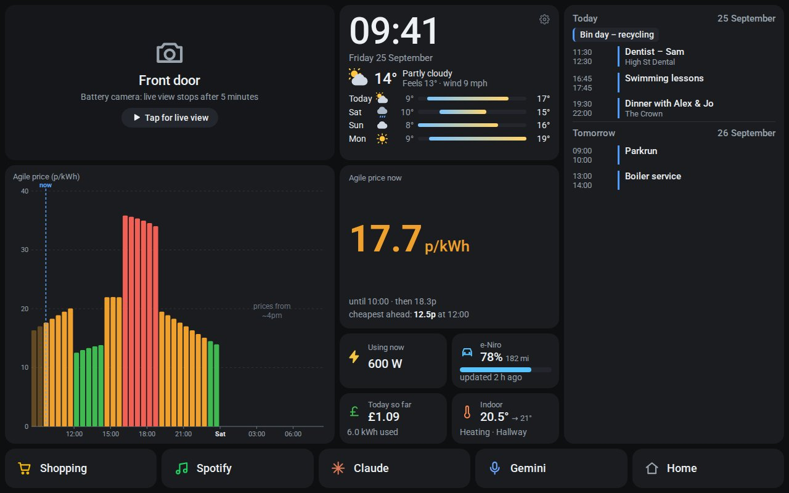

# Home panel for a Lenovo Tab M10

A wall panel for a Lenovo Tab M10 (3rd gen, TB328), built as **one web page on GitHub Pages**. There's no Home Assistant, no server and nothing else to leave switched on. The tablet's browser talks straight to Google, Octopus and the weather service.

**Your panel:** `https://anginsemilir.github.io/Home-Dashboard-/` (after the one-off setup below)



## What's on it

| | Status | How |
|---|---|---|
| **Nest camera** (battery) | ✅ | Card says "Front door · Tap for live view". A tap starts a live WebRTC stream straight from Google. A battery camera stops after 5 minutes to save its battery; ✕ stops it sooner. |
| **Nest thermostat** temperature | ✅ | Nest (Smart Device Management) API, every 5 min. Shows the target temperature and Heating/Idle/Eco. |
| **Google Calendar**, today and tomorrow | ✅ | Calendar API, same Google sign-in. Finished events drop off; all-day events show as chips. |
| **Weather** now + 4 days | ✅ | Open-Meteo (free, no key). |
| **Agile price now**, rest of today, tomorrow after ~4pm | ✅ ⚠️ | Octopus's public prices API. The panel finds your tariff and region from your account. Colours: green < 15p, amber, red ≥ 25p, blue at or below 0p (you can change these). |
| **Home Mini live usage** + £ so far today | ✅ ⚠️ | Octopus's API (`smartMeterTelemetry`), every 60 s. |
| **Buttons:** Shopping (Keep), Spotify, Claude voice, Gemini voice, Home | ✅ | Android `intent:` links. All five work in the free **WebView Kiosk** app; in Chrome, Home can't work (use the swipe). See [docs/voice-and-apps.md](docs/voice-and-apps.md). |
| **Kia e-Niro battery** (optional) | 🧪 | A free GitHub Action reads the car's last-reported battery once an hour and publishes it **encrypted**. It's an experiment: Kia may block it. See [docs/kia.md](docs/kia.md). |
| Night dimming, screen always on, offline start | ✅ | Near-black screen 22:30–06:30 when nobody's touched it for 90 s (tap to wake); Wake Lock; cached data if the internet drops. |

⚠️ = expected to work from the browser, but **the first thing to check on the tablet**: some sites say Octopus blocks direct browser calls, others work fine. If yours is blocked, a free 5-minute fix is in [docs/octopus.md](docs/octopus.md#if-octopus-is-blocked).

**Cost:** £0, plus Google's one-off **US$5** Device Access fee (every app that reads Nest devices needs it). GitHub Pages, Open-Meteo and the Octopus API are free.

## Your keys stay on the tablet

The site is public, so it contains **no keys and no personal data**. Anyone else who opens the URL sees an empty "set me up" screen. You type your Octopus API key and Google details once, into the panel's own Settings screen on the tablet. They're stored only in that browser's storage and only ever sent to the service they belong to.

The one exception is the optional Kia job: your Kia login goes into GitHub's encrypted **Actions secrets**, never into the code.

## Set it up (about an hour)

1. **Turn on GitHub Pages:** in this repository, Settings → Pages → Source: **GitHub Actions**. Then Actions → "Test and publish" → Re-run. After a minute the URL above works.
2. **Tablet:** install WebView Kiosk and point it at the URL: [docs/tablet.md](docs/tablet.md). The first time, the panel opens its Settings screen with a setup checklist.
3. **Weather:** type your postcode → Find.
4. **Octopus:** account number + API key → Connect ([docs/octopus.md](docs/octopus.md)). The checklist turns ✓ for prices and Home Mini, **or tells you if Octopus is blocked**.
5. **Google (Nest + Calendar):** the longest step, about 30 minutes, done once. [docs/google.md](docs/google.md). You'll sign in **in Chrome on the tablet**, then copy the settings into the kiosk app (Google doesn't allow sign-in inside kiosk apps).
6. **Voice:** "Hey Google", the Keep shopping list and Spotify: [docs/voice-and-apps.md](docs/voice-and-apps.md).
7. Optional: **Kia battery**: [docs/kia.md](docs/kia.md).

If something shows a small amber or red dot, tap the card for the reason, or see [docs/troubleshooting.md](docs/troubleshooting.md). To change colours, layout or add something, see [docs/customising.md](docs/customising.md).

## What I could and couldn't test

Everything was tested in a browser against **fake** versions of every service: 33 unit tests and 15 browser tests, including clock-change days, midnight, night mode, the camera's 5-minute stop, every button's link and three screen sizes. These things can only be confirmed on your tablet, and the setup checklist shows them:

- that Octopus accepts calls from the page (if not, use the proxy in [docs/octopus.md](docs/octopus.md#if-octopus-is-blocked));
- real Google sign-in and a real camera stream;
- exactly what the Claude, Gemini and Home buttons open inside WebView Kiosk;
- whether Kia lets GitHub's servers log in.

## How it's built

Plain HTML, CSS and JavaScript modules in [`web/`](web/), with no build step and no libraries, so you (or Claude) can edit it directly. [`web/js/`](web/js/) has one file per service (`octopus.js`, `google.js`, `nest.js`, `calendar.js`, `weather.js`, `kia.js`), plus `launcher.js` for the buttons and `ui.js` for the layout. `.github/workflows/pages.yml` runs the tests and publishes `web/` on every push.

```sh
npm install          # Playwright, for the browser tests
npm test             # unit tests
npm run test:e2e     # browser tests (all services faked)
npm run preview      # screenshots in shots/ at three tablet sizes
npm run serve        # http://127.0.0.1:8080/Home-Dashboard-/
```

**The earlier Home Assistant version** (commit [`46756f4`](https://github.com/AnginSemilir/Home-Dashboard-/tree/46756f4)) is still in the history if you ever want it. It needed an always-on computer; this version doesn't.
