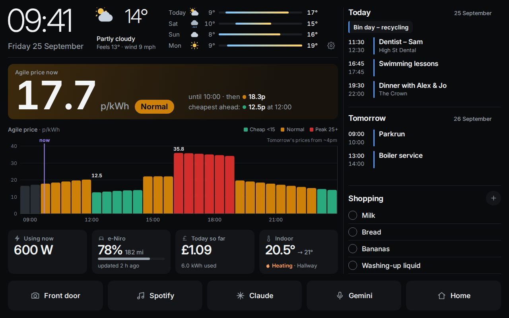
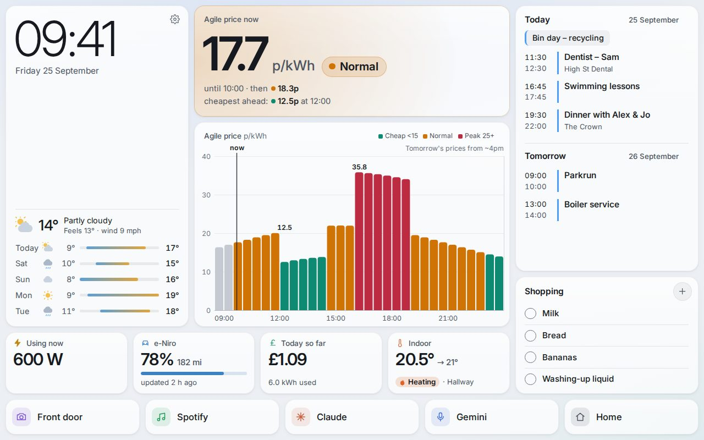

# Home panel for a Lenovo Tab M10

A wall panel for a Lenovo Tab M10 (3rd gen, TB328), built as **one web page on GitHub Pages**. There's no Home Assistant, no server and nothing else to leave switched on. The tablet's browser talks straight to Google, Octopus and the weather service.

**Your panel:** `https://anginsemilir.github.io/Home-Dashboard-/` (after the one-off setup below)



<details><summary>The Ambient style, light theme</summary>


</details>

## What's on it

| | Status | How |
|---|---|---|
| **Nest camera** (battery) | ✅ | The first button in the dock ("Front door"). A tap starts a live WebRTC stream straight from Google, full screen; tap the picture to shrink it to a corner and keep an eye on the door. A battery camera stops after 5 minutes to save its battery; ✕ stops it sooner. |
| **Doorbell pop-up** (optional) | ✅ | When someone rings, the doorbell's live view fills the screen with "Someone's at the door" and a chime, even at night. Google sends presses through Pub/Sub in your own Cloud project (free tier). See [docs/doorbell.md](docs/doorbell.md). |
| **Nest thermostat** temperature | ✅ | Nest (Smart Device Management) API, every 5 min. Shows the target temperature and Heating/Idle/Eco. |
| **Google Calendar**, today and tomorrow | ✅ | Calendar API, same Google sign-in. Finished events drop off; all-day events show as chips. |
| **Shopping list** | ✅ | A Google Tasks list, under the calendar. Tap an item to tick it off (with Undo), **+** to add one; add by voice with "Hey Google". Same Google sign-in. (Google Keep has no API a web page can use, so the list lives in Google Tasks.) |
| **Weather** now + 4 days | ✅ | Open-Meteo (free, no key). |
| **Agile price now**, rest of today, tomorrow after ~4pm | ✅ ⚠️ | Octopus's public prices API. The panel finds your tariff and region from your account. Colours: green < 15p, amber, red ≥ 25p, blue at or below 0p (you can change these); the price box takes the colour of the price now. Tap a bar for its price and time. Until tomorrow's prices arrive (about 4pm) the chart spreads today's across its width. The small chart button on the price box shows your **average price** over the last 30 minutes, the last hour, today, this week, this month and this year. |
| **Home Mini live usage** + £ so far today | ✅ ⚠️ | Octopus's API (`smartMeterTelemetry`), every 60 s. |
| **Spotify controls** (optional, needs Premium) | ✅ | The music button shows what's playing; a tap opens play/pause, skip, volume and **Play on** (move it to another speaker). Spotify's Web API, signed in once from the panel. See [docs/spotify.md](docs/spotify.md). Amazon Music has no API for this, so its button just opens the app. |
| **Buttons:** Camera, Music (Spotify or Amazon Music), AI (Claude or Gemini), Assistant, Home | ✅ | Android `intent:` links. In the free **WebView Kiosk** app, Claude and the Assistant go straight to listening and Home goes to the home screen; in Chrome they open the apps normally and Home can't work (use the swipe). See [docs/voice-and-apps.md](docs/voice-and-apps.md). |
| **Kia e-Niro battery** (optional) | 🧪 | A free GitHub Action reads the car's last-reported battery once an hour and publishes it **encrypted**. It's an experiment: Kia may block it. See [docs/kia.md](docs/kia.md). |
| Two looks, light by day | ✅ | ⚙ → Panel → **Style**: *Bold* or *Ambient*. **Theme**: *Auto* goes light at sunrise and dark at sunset where the tablet is (its location, if allowed: [docs/tablet.md](docs/tablet.md), step 4), or always light / always dark. |
| Night dimming, screen always on, offline start | ✅ | Near-black screen 22:30–06:30 when nobody's touched it for 90 s (tap to wake); Wake Lock; cached data if the internet drops. |

⚠️ = expected to work from the browser, but **the first thing to check on the tablet**: some sites say Octopus blocks direct browser calls, others work fine. If yours is blocked, a free 5-minute fix is in [docs/octopus.md](docs/octopus.md#if-octopus-is-blocked).

**Cost:** £0, plus Google's one-off **US$5** Device Access fee (every app that reads Nest devices needs it). GitHub Pages, Open-Meteo and the Octopus API are free.

## Your keys stay on the tablet

The site is public, so it contains **no keys and no personal data**. Anyone else who opens the URL sees an empty "set me up" screen. You type your Octopus API key and Google details once, into the panel's own Settings screen on the tablet. They're stored only in that browser's storage, and the panel only ever sends each one to the service it belongs to. (One caveat: the browser shares that storage with any other page on `anginsemilir.github.io`. See [docs/tablet.md](docs/tablet.md#keeping-the-keys-safe).)

The one exception is the optional Kia job: your Kia login goes into GitHub's encrypted **Actions secrets**, never into the code.

## Set it up (about an hour)

1. **Turn on GitHub Pages:** in this repository, Settings → Pages → Source: **GitHub Actions**. Then Actions → "Test and publish" → Re-run. After a minute the URL above works.
2. **Tablet:** install WebView Kiosk and point it at the URL: [docs/tablet.md](docs/tablet.md). The first time, the panel opens its Settings screen with a setup checklist.
3. **Weather:** type your postcode → Find.
4. **Octopus:** account number + API key → Connect ([docs/octopus.md](docs/octopus.md)). The checklist turns ✓ for prices and Home Mini, **or tells you if Octopus is blocked**.
5. **Google (Nest, Calendar, shopping list):** the longest step, about 30 minutes, done once. [docs/google.md](docs/google.md). You'll sign in **in Chrome on the tablet**, then copy the settings into the kiosk app (Google doesn't allow sign-in inside kiosk apps).
6. **Voice:** "Hey Google", the shopping list and Spotify: [docs/voice-and-apps.md](docs/voice-and-apps.md).
7. Optional: **Spotify controls** on the panel: [docs/spotify.md](docs/spotify.md). **Doorbell pop-up and chime**: [docs/doorbell.md](docs/doorbell.md).
8. Optional: **Kia battery**: [docs/kia.md](docs/kia.md).

If something shows a small amber or red dot, tap the card for the reason, or see [docs/troubleshooting.md](docs/troubleshooting.md). To change colours, layout or add something, see [docs/customising.md](docs/customising.md).

The research behind each part (APIs, what's possible on Android, sources) is saved in [docs/research](docs/research/README.md).

## What I could and couldn't test

Everything was tested in a browser against **fake** versions of every service: 83 unit tests and 55 browser tests (the browser tests run once per style), including clock-change days, midnight, night mode, sunrise/sunset theme changes, the camera's 5-minute stop and error handling, a Home Mini or Kia job that stops reporting, ticking off and adding shopping items, every button's link and three screen sizes. These things can only be confirmed on your tablet, and the setup checklist shows them:

- that Octopus accepts calls from the page (if not, use the proxy in [docs/octopus.md](docs/octopus.md#if-octopus-is-blocked));
- real Google sign-in and a real camera stream;
- exactly what the AI (Claude or Gemini), Assistant and Home buttons open inside WebView Kiosk;
- whether Kia lets GitHub's servers log in.

## How it's built

Plain HTML, CSS and JavaScript modules in [`web/`](web/), with no build step and no libraries, so you (or Claude) can edit it directly. [`web/js/`](web/js/) has one file per service (`octopus.js`, `google.js`, `nest.js`, `calendar.js`, `tasks.js`, `spotify.js`, `weather.js`, `kia.js`), plus `launcher.js` for the buttons, `ui.js` for the cards and `sun.js` for the light/dark switch. The two looks are `web/css/bold.css` and `web/css/ambient.css`. `.github/workflows/pages.yml` runs the tests and publishes `web/` on every push.

```sh
npm install                      # Playwright, for the browser tests
npx playwright install chromium  # once: the browser the tests drive (add --with-deps on Linux)
npm test             # unit tests
npm run test:e2e     # browser tests (all services faked)
npm run preview      # screenshots in shots/ at three tablet sizes
npm run serve        # http://127.0.0.1:8080/Home-Dashboard-/
```

**The earlier Home Assistant version** (commit [`46756f4`](https://github.com/AnginSemilir/Home-Dashboard-/tree/46756f4)) is still in the history if you ever want it. It needed an always-on computer; this version doesn't.
